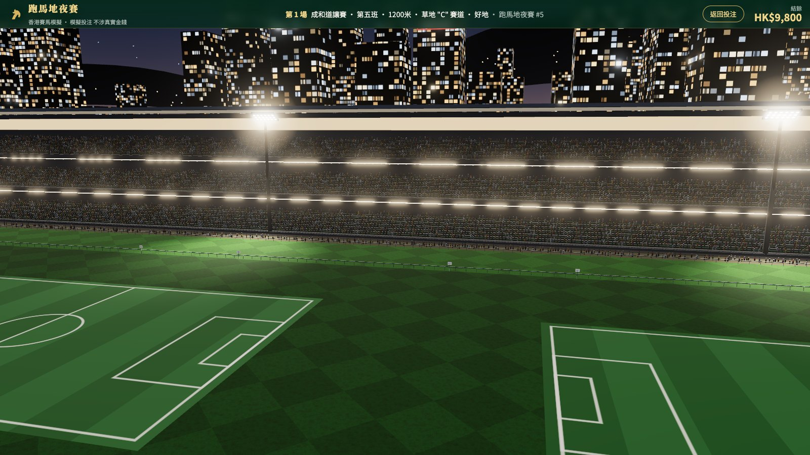
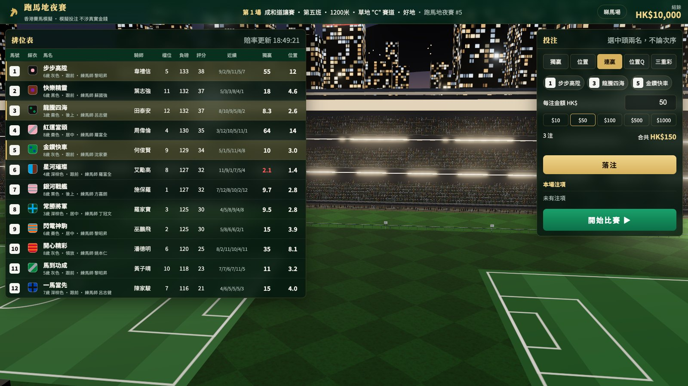
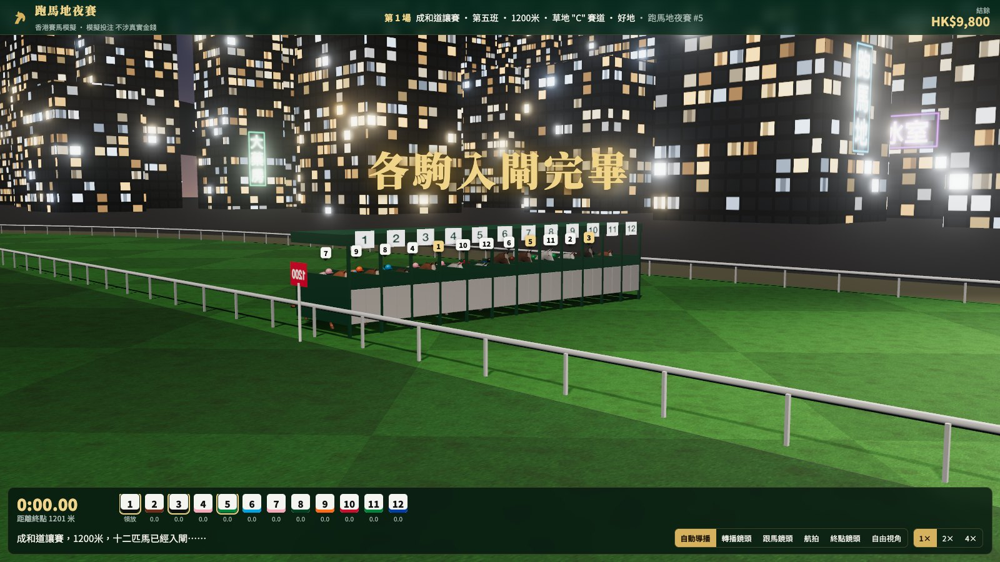
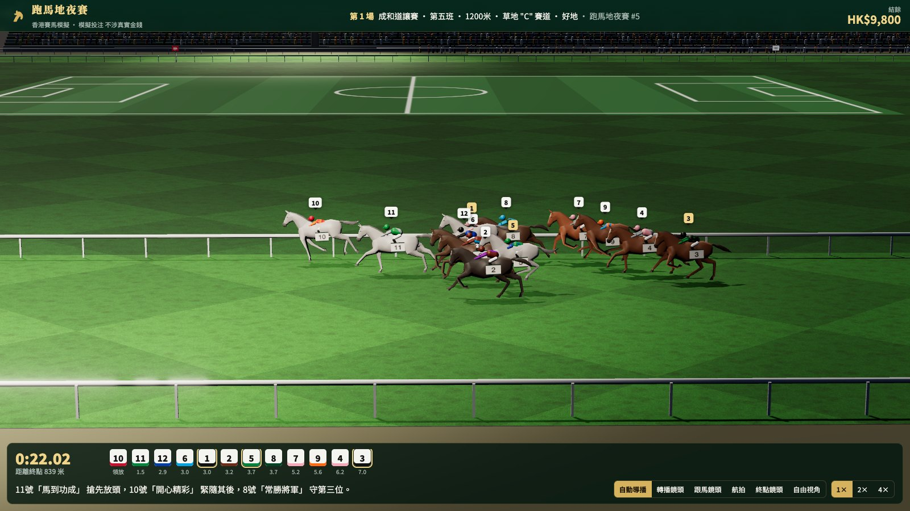
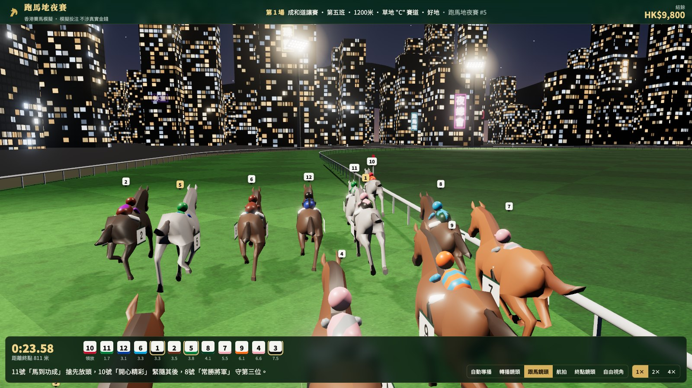
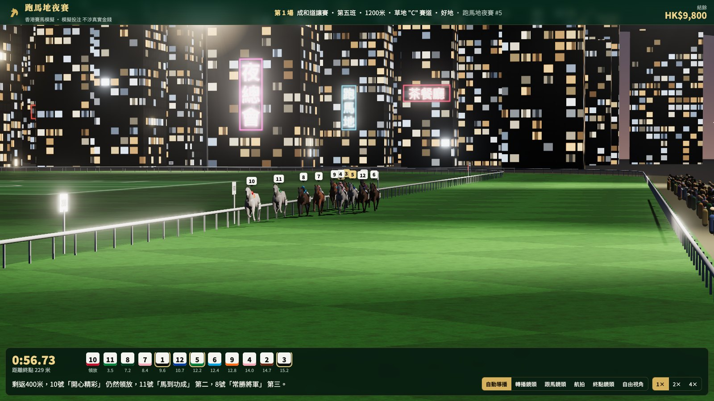
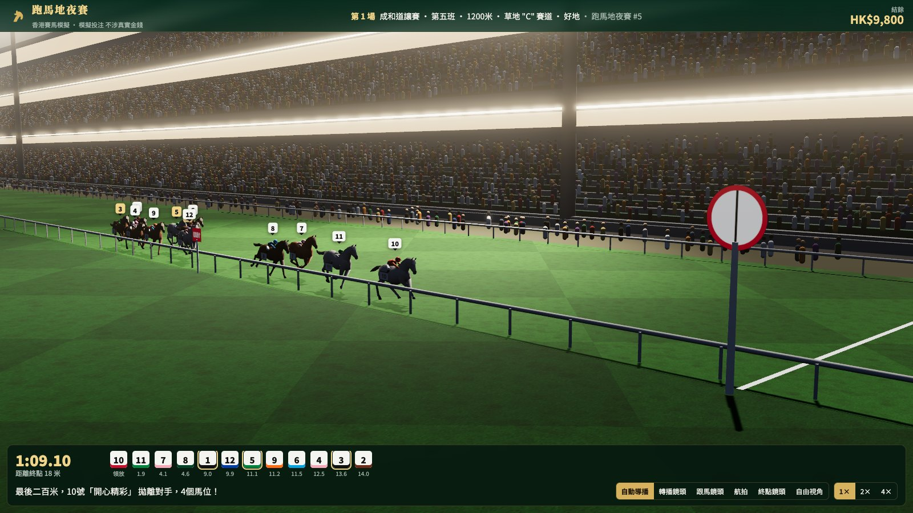
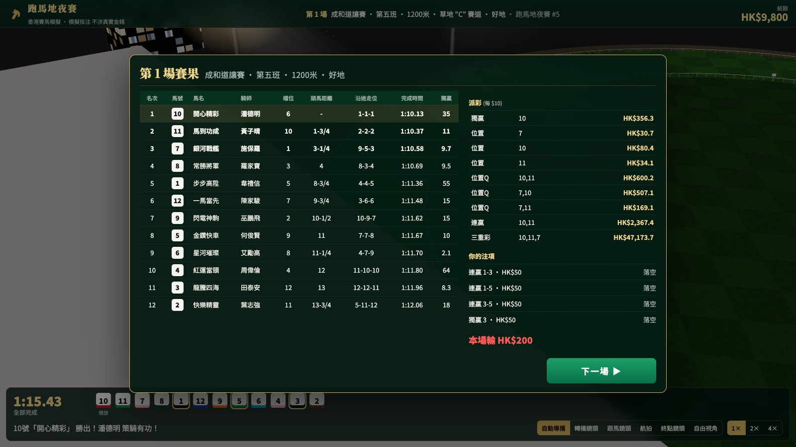
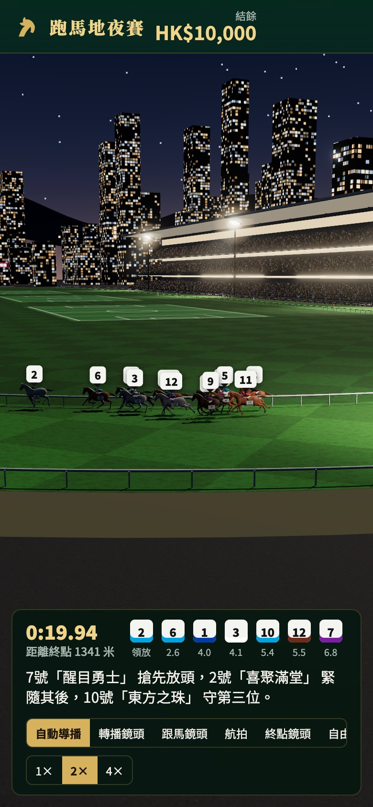

# 跑馬地夜賽 · HK Racing Simulator

A realistic 3D horse-racing betting simulator for the browser, set at a floodlit **Happy Valley (跑馬地)** Wednesday-night meeting. The UI is in Traditional Chinese. You study the race card, bet on pari-mutuel pools, watch the race through TV-style cameras with Cantonese race calls, and collect your dividends.

Built with **Three.js + Vite**, with no backend. All betting uses virtual money only.



## Screenshots

| Race card & betting slip | Loaded in the stalls |
|---|---|
|  |  |
| **Broadcast camera** | **Chase camera** |
|  |  |
| **Head-on down the straight** | **At the winning post** |
|  |  |

| Results & dividends | On a phone |
|---|---|
|  |  |

## Features

**The course and the night**
- **Track:** a right-handed turf oval (1,565 m) with a mowing pattern, white running rails, distance poles every 100 m, a winning post and a judge's box.
- **Infield:** lit football pitches and a giant screen. The screen shows a tote board of live odds before the race, then the TV feed during it.
- **Grandstand:** three tiers with a crowd of thousands that jumps up as the field reaches the last 400 m.
- **City:** high-rise towers with lit windows, flickering Chinese neon signs (茶餐廳, 金行, 夜總會 …), aircraft beacons and hills behind the back straight.
- **Lighting:**
  - 10 floodlight towers with real spot lights, glowing lamp heads and faint beams in the haze.
  - A shadow-casting key light that follows the field.
  - ACES tone mapping with bloom (glow on bright lights).

**Horses**
- **Animation:** morph-animated gallop, with each horse's stride rate following its speed and lateral lean when changing lanes.
- **Looks:** coats in bay (棗), chestnut (栗), dark brown (深棕), grey (灰) and black (黑).
- **Riders:** each jockey wears procedurally generated silks (hoops, sash, halves, diamonds …) and bobs with the stride. Each horse wears a numbered saddle cloth.

**Race engine** (`src/core/sim.js`)
- **Ability:** hidden current form plus rating, handicap weight (113–133 lb), draw bias and distance suitability.
- **Running styles:** 領放 / 跟前 / 居中 / 後上, each with its own pace shape.
- **In-running:** standing starts, slow breaks, traffic and blocked runs, lane changes, and extra ground covered when running wide on the turns.
- **Calibrated:** winning times match 跑馬地 standards (1000 m ≈ 57 s, 1200 m ≈ 69.5 s, 1650 m ≈ 99.5 s, 1800 m ≈ 109.5 s). The favourite wins about 25–30% of races.

**Betting** (`src/core/betting.js`)
- **Pools:** 獨贏 (Win), 位置 (Place), 連贏 (Quinella), 位置Q (Quinella Place) and 三重彩 (Tierce).
- **Pari-mutuel maths:** HKJC-style deductions and dividends quoted per $10. Place and QP profit is split three ways, and the minimum dividend is $10.
- **Simulated public money:** comes with a favourite–longshot bias. Odds drift while betting is open, with shortening prices flashed red (落飛). Your own bets move the pools too.
- **Combinations:** 複式 bets on multiple horses. The balance is kept per browser.

**Broadcast**
- **Auto director:** cuts between the gate, a side-on TV shot, the classic head-on view down the home straight, and the winning post. You can also choose the chase, aerial or free (drag to orbit) camera.
- **Live coverage:** Cantonese race calls, a running-order strip with lengths behind the leader, a race clock, and 1× / 2× / 4× speed.
- **Results:** HK-style 賽果 with 頭馬距離 (短頭位, 頸位, 3/4 …), 沿途走位, finishing times and the full 派彩 table, plus your bets and net result.

## Run it

```bash
npm install
npm run dev        # http://localhost:5190 (also bound on the LAN)
npm run build      # static build in dist/
```

| URL param | Effect |
|---|---|
| `?seed=N` | Reproducible race card / meeting |
| `?speed=1…8` | Race speed multiplier |
| `?q=low` | Lighter render (no shadows or MSAA, fewer lights) for weaker GPUs |

Press **H** (or tap **睇馬場**) to hide the panels and look around the course.

## Tests

```bash
npm test           # core unit tests: track geometry, race sim, pools & dividends
npm run e2e        # Playwright E2E in system Chrome with the real GPU (Metal/ANGLE)
```

The E2E suite plays a full meeting through the real UI:
- It checks that the WebGL scene actually renders.
- It places 獨贏 / 位置 / 連贏 複式 / 三重彩 bets and confirms that overspending is blocked.
- It runs the race, checks the results table, and recomputes the new balance from the dividends.
- It moves to the next race and fails on any console error.

Two more tests cover the balance surviving a reload and the phone layout.

## Project layout

```
src/core/     pure logic, no three.js: track geometry, race card data, sim, betting, commentary
src/scene/    world (renderer, bloom, sky, city), course, horses & jockeys, camera director
src/ui.js     DOM: race card, slip, live strip, results
src/main.js   game loop and race lifecycle
```

## Notes

- Horse, jockey and trainer names are fictional. The project is not affiliated with the Hong Kong Jockey Club.
- The horse model is the animated `Horse.glb` from the [three.js examples](https://github.com/mrdoob/three.js/tree/dev/examples/models/gltf) (MIT). It is low-poly, so it reads as stylised up close.
